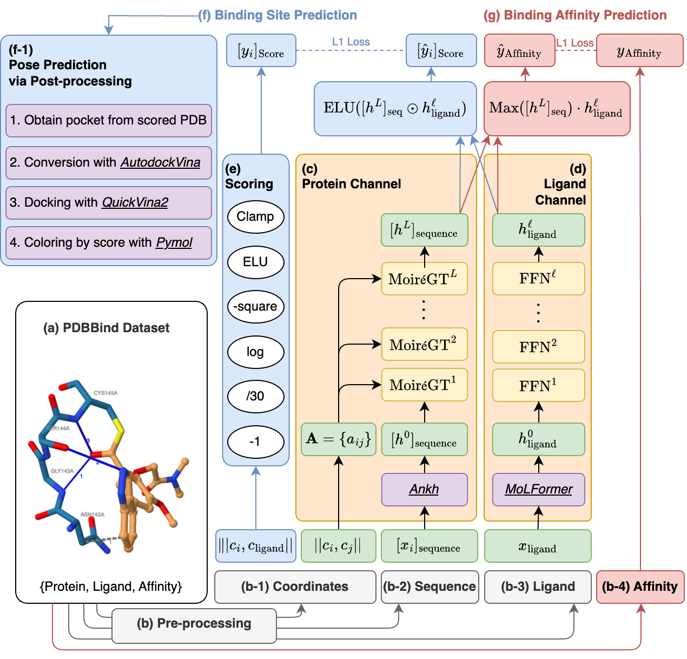

# DeepFold-Interact: Balancing Ligand and Protein Channel for Protein-Ligand Interaction Prediction

This repository is the official implementation of “DeepFold-Interact: Balancing Ligand and Protein Channel for Protein-Ligand Interaction Prediction”, under review at the [RECOMB 2025 conference](https://recomb.org/recomb2025/).

## Citation
```
comming soon
```

## Overview

### Main Contributions:

1. Explicitly use ligand information to predict protein-ligand interaction sites.
2. Employing cutting-edge neural network architectures, including [Large Language Models](https://github.com/agemagician/Ankh) and graph transformers in both [molecular](https://github.com/IBM/molformer) and [protin](https://openreview.net/forum?id=sJzfxRbEv6) channel.
3. Implementing sophisticated scoring process to balance interacting and non-interacting residues' information.
4. Achieving state-of-the-art affinity prediction on the PDBbind2020 dataset.



### Abstract

Protein-ligand interactions are essential for drug discovery and biological understanding, yet explicit ligand information remains underexplored. This paper presents DeepInteract, a graph transformer-based model that predicts protein-ligand interaction sites using a novel regression framework. Leveraging neural network architectures, including Large Language Models and graph transformers, DeepInteract applies a specialized scoring system to address interaction imbalances, enabling nuanced predictions. Our model achieves state-of-the-art affinity prediction on the PDBbind2020 dataset and performs well on binding site predictions,including CASP16 targets. By explicitly integrating ligand data,DeepInteract offers precise, adaptable insights with potential drug discovery and structural biology applications.

### Authors

- **San Kim**<sup>1</sup> [](https://orcid.org/0000-0002-7681-7987)
- **Seungjun Lee**<sup>2</sup> [](https://orcid.org/0009-0003-9913-6871)
- **Sichan Oh**<sup>3</sup> [](https://orcid.org/0009-0005-5232-3586)
- **Minsoo Kim**<sup>4</sup> [](https://orcid.org/0000-0002-3961-9703)
- **Jejoong Yoo**<sup>4</sup> [](https://orcid.org/0000-0001-7120-8464)
- **Jaekwang Kim**<sup>1,2,†</sup> [](https://orcid.org/0000-0001-5174-0074)
- **Keehyoung Joo**<sup>5,†</sup> [](https://orcid.org/0000-0002-4612-0927)
<sup>†</sup> Corresponding authors.

1. Department of Computer Science and Engineering, Sungkyunkwan University, Suwon, Republic of Korea
2. Department of Immersive Media Engineering / Convergence Program for Social Innovation, Sungkyunkwan University, Suwon, Republic of Korea
3. Department of Electrical and Computer Engineering, Sungkyunkwan University, Suwon, Republic of Korea
4. Department of Physics, Sungkyunkwan University, Suwon, Republic of Korea
5. Korea Institute for Advanced Study (KIAS), Seoul, South Korea

## Usage
1. Clone the repository
```bash
git clone https://github.com/saankim/Deepfold-Interact.git
cd Deepfold-Interact
```

2. Download the [PDBbind dataset](https://www.pdbbind-plus.org.cn)

2. Preprocessing codes

Edit script before use. e.g., `dataset path` and `output path`.
```bash
python pre.py
```

For affinity target, make affinity target file. with `makes/make_target_affinity.py`

3. Training codes

Edit script before use. e.g., `dataset path`, `output path`, and `output dimensions`.

```bash
python train.py
```

## Contact Info

- **San Kim** (saankim@skku.edu)

Sincerely appreciate your suggestions on our work!


## License

This project is licensed under the terms of the MIT license. See [LICENSE](https://github.com/saankim/Deepfold-Interact/blob/main/LICENSE) for additional details.
